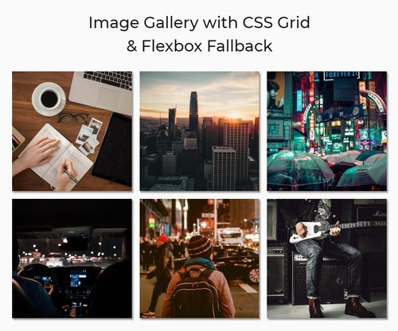

# Image Gallery with CSS Grid & Flexbox
This project demonstrates how CSS Grid (with flexbox fallback) can be used to create a responsive image gallery with no media queries.

## Live Demo
A live demo is available on [CodePen](https://cdpn.io/vdqYom).

## License
This project is licensed under the MIT License - see the [license.md](license.md) file for details.
